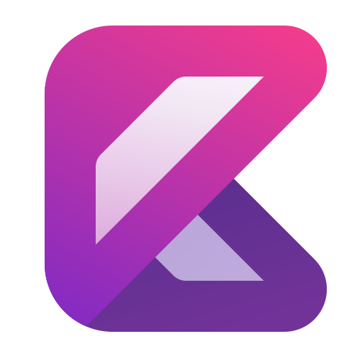
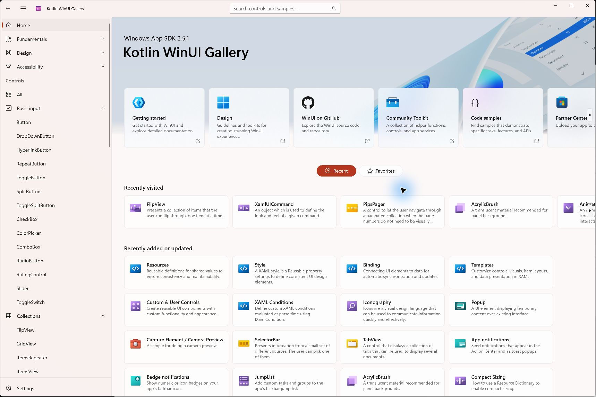
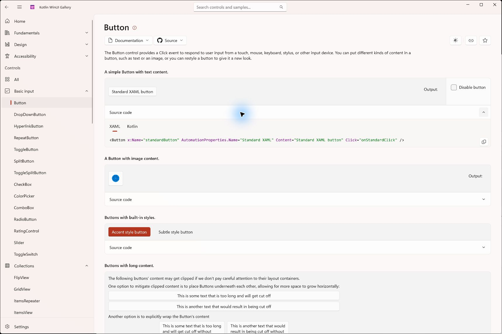

<h1> Kotlin/WinRT</h1>

[](https://github.com/compose-fluent/kotlin-winrt/actions/workflows/release.yml)
[](https://github.com/compose-fluent/kotlin-winrt/actions/workflows/publish-snapshot.yml)
[](#requirements)
[](#requirements)

**Build Windows apps with Kotlin, XAML and native WinUI 3 controls.**

Kotlin/WinRT projects Windows Runtime APIs into Kotlin. Share application code and XAML between **Kotlin/Native `mingwX64` and Kotlin/JVM**, and use Gradle to generate API bindings, compile XAML and package your app. The project uses **Windows App SDK 2.5.1**.



*The Kotlin WinUI Gallery runs the same Kotlin/XAML application on both targets. [See examples and downloads](#gallery-and-downloads).*

## Quick start

### Requirements

- **Windows x64**, with **JDK 25** and the Gradle **9.4.0** wrapper.
- Visual Studio / Build Tools with **Desktop development with C++** and **Windows SDK 10.0.26100.0**.
- **Windows Developer Mode** for AppX development runs.
- Kotlin **2.4.0** or **2.4.20** when creating an application.

The Gradle toolkit provisions WinApp CLI and the Kotlin-aware XAML compiler, restores NuGet packages and stages the native runtime files. Build from an ordinary terminal; the toolkit discovers the installed C++ build tools.

### Run the Gallery

Clone the repository and launch the Native application with AppX identity:

```powershell
git clone --recursive https://github.com/compose-fluent/kotlin-winrt.git
cd kotlin-winrt
.\gradlew.bat :winui-gallery:runWinAppPackageMingwX64MainDebugExecutable --args=Home --detach
```

To run the JVM target instead:

```powershell
.\gradlew.bat :winui-gallery:runWinAppPackageWinuiJvmMain --args=Home --detach
```

Run one target at a time. AppX development tasks register a `.dev` package and launch the application with package identity, including `ms-appx:///` resource access. They do not require signing an MSIX. Use these `runWinAppPackage...` tasks as the default development entry point.

### Create your application

Use a Kotlin Multiplatform project with **both `mingwX64` and JVM targets**:

```text
hello-winrt/
  settings.gradle.kts
  app/                 # Shared Kotlin/XAML sources, manifest and icons
  winrt-projections/   # Shared generated Windows SDK and WinUI APIs
```

The Windows toolkit is published through Maven Central. While Gradle Plugin Portal approval is pending, resolve its plugin ID explicitly in `settings.gradle.kts`:

```kotlin
pluginManagement {
    repositories {
        mavenCentral()
        gradlePluginPortal() // Kotlin and other plugins
    }
    resolutionStrategy {
        eachPlugin {
            if (requested.id.id == "io.github.compose-fluent.windows-toolkit") {
                useModule(
                    "io.github.compose-fluent:windows-toolkit-gradle-plugin:${requested.version}"
                )
            }
        }
    }
}

dependencyResolutionManagement {
    repositories { mavenCentral() }
}

rootProject.name = "hello-winrt"
include(":app", ":winrt-projections")
```

Follow the [WinUI quick start](docs/QUICKSTART.md) for the complete Gradle files, manifest setup and `Application.start` entry point. It uses toolkit **0.1.0**, Windows App SDK **2.5.1**, and a shared `winuiMain` source set.

Place `MainWindow.xaml` beside `MainWindow.kt` under `app/src/winuiMain/kotlin/sample/hello/`:

```xml
<Window x:Class="sample.hello.MainWindow"
        xmlns="http://schemas.microsoft.com/winfx/2006/xaml/presentation"
        xmlns:x="http://schemas.microsoft.com/winfx/2006/xaml"
        Title="Hello Kotlin">
    <StackPanel Spacing="12" Padding="24">
        <TextBlock x:Name="Greeting" Text="Hello from Kotlin WinRT" />
        <Button Content="Say hello" Click="onHelloClick" />
    </StackPanel>
</Window>
```

```kotlin
package sample.hello

import microsoft.ui.xaml.RoutedEventArgs
import microsoft.ui.xaml.Window

class MainWindow : Window() {
    private fun onHelloClick(sender: Any?, args: RoutedEventArgs) {
        Greeting.text = "Hello from Kotlin code-behind"
    }
}
```

The compiler generates typed named-element access and initializes the XAML component after construction. Gradle compiles the shared sources for both targets.

Once the [application setup](docs/QUICKSTART.md) is complete, run either target with AppX identity:

```powershell
.\gradlew.bat :app:runWinAppPackageMingwX64MainDebugExecutable --detach
.\gradlew.bat :app:runWinAppPackageJvmMain --detach
```

## What you can build

- Call WinRT APIs through generated Kotlin bindings, including the implemented activation, delegates, collections and async surfaces.
- Write WinUI layouts with Kotlin code-behind, named controls, events, compiled bindings, resources and templates.
- Generate projections from Windows SDK, NuGet or local WinMD files, or consume [prebuilt projections](docs/USAGE.md#prebuilt-projections). The prebuilt Windows App SDK coordinate is `io.github.compose-fluent:winrt-projections-windows-app-sdk:2.5.1`.
- Build JVM launchers and Native executables, author WinRT components, and create/sign MSIX packages through Gradle.

The implementation follows Microsoft's [CsWinRT](https://github.com/microsoft/CsWinRT) and [C++/WinRT](https://github.com/microsoft/cppwinrt) projection model. See [CHANGELOG.md](CHANGELOG.md) for the initial release's scope.

## Gallery and downloads

The **Kotlin WinUI Gallery** contains 122 routes and 355 example documents, with interactive controls and a XAML/Kotlin source viewer. Layouts and assets are ported from the official WinUI Gallery with [third-party attribution](winui-gallery/THIRD-PARTY-NOTICES.md).



Download from the [0.1.0 release](https://github.com/compose-fluent/kotlin-winrt/releases/tag/v0.1.0) once the tag's release workflow completes:

| Asset | Purpose |
| --- | --- |
| `Kotlin-WinUI-Gallery-0.1.0-mingwX64.msix` | Native Gallery |
| `Kotlin-WinUI-Gallery-0.1.0-jvm.msix` | Gallery with a bundled JVM runtime |
| `kotlin-winrt-ide-0.1.0-<variant>.zip` | IDE plugin |
| `winui-gallery-signing.cer` | Public package signing certificate |
| `SHA256SUMS.txt` | Download checksums |

Install one Gallery variant at a time; both use the same application identity. The framework-dependent packages require the matching Windows App Runtime. If the signer is not already trusted, verify and trust the supplied public certificate before installing. See the [Gallery guide](winui-gallery/README.md) for source builds and packaging.

## Optional IDE plugin

The IDE plugin adds completion, navigation, diagnostics, project templates and run/debug integration. Install the matching ZIP with **Settings → Plugins → Install Plugin from Disk**. Its **WinUI XAML Application** template creates the application and projection modules, shared sources, manifest, icons and bundled Maven toolchain; enable both targets.

| ZIP variant | IDE SDK used to build and validate it |
| --- | --- |
| `idea-262` | IntelliJ IDEA 2026.2.2 |
| `as-261` | Android Studio Quail 4 / 2026.1.4.7 |
| `as-canary-262` | Android Studio Rabbit 2 Canary 2 / 2026.2.2.2 |

IDE Run/Debug and Hot Reload currently target JVM. XAML Preview is temporarily disabled. See [IDE setup](winrt-compiler-plugin/ide/README.md) and [Hot Reload](winrt-runtime/HOT_RELOAD.md) for supported edits and current limitations.

## Further reading

[WinUI quick start](docs/QUICKSTART.md) · [Usage and packaging](docs/USAGE.md) · [Gallery](winui-gallery/README.md) · [Compiler](winrt-compiler-plugin/README.md) · [Release procedure](docs/RELEASING.md) · [Benchmarks](winrt-benchmarks/README.md)
